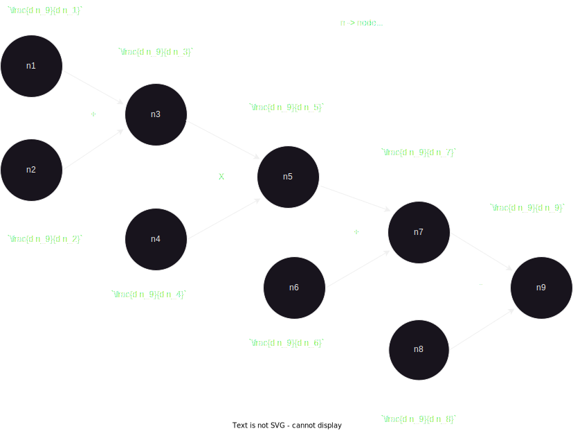

This folder holds the detailed "theoretical" explanation of micrograd!
For hands-on implementation dig into the other folders.

First, a brief intuition, from a node to ChatGPT.
1. So, what's a neural network?
    * It's essentialy a graph of nodes. But what makes that graph a neural network is the property of each node to hold gradients.

2. Now, what is gradient?
    * gradient is always between two nodes. So if you say gradient of n2 wrt n1. It means, by a little change in the value of n1 how does it change the value of n2, expressed as dn2/dn1.
3. Now, why is gradient important in a neural network?
    * Because if n1 can be your input, n2 your prediction, then through dn2/dn1 the neural net can grasp what changes in input leads to what changes in output.
4. Now, imagine you scale this fundamental intuition to millions of nodes. 
    * Then, you can expect with an increase in nodes, the complexity of patterns a neural net can learn to model also drastically increases. 
5. The most dramatic example being that of ChatGPT.
    * It's just a billion if not trillion node graph that learned to model the intricate behaviour of humans through their projected shadow on the internet.
    * Obviously there is more to how you actually build a ChatGPT like model. Something only few experts can build, but fundamentally it is a graph where the nodes represent the complex realtions that define the world.

Great! but what's backpropogation?

Now, that's when we get into how gradients actually get calculated! Welcome to the most simple yet elegant math formulae that changed the world forever.

So first, let's setup a simple neural-network.


Let's give some meaning to this neural net.
Let's suppose, we want the net to learn the AND logic gate.
Here is how an AND gate looks
```
    Expected behaviour:
        Input  | output
         0 0   | 0
         0 1   | 0
         1 0   | 0
         1 1   | 1
```
Since, AND gate expects two binary valued inputs.
We setup 2 neurons as the starting nodes of the graph.
n1, n2 are nodes that take in binary inputs, like (1, 0).

Then, we combine input neurons with few more neurons, namely n3,4..n7.
These neurons help in learning the relation between input and the expected output.
Notice few neurons are created from a combination of 2 source neurons, like n3=n1+n2.
These operations allow the neural net to model complex data patterns. More complex the operations get, the more complex data patterns, a neural net can learn.

Important thing to note. The actual neural net consists of 7 neurons, from n1-n7.
Now what are n8 and n9 then?
Well they are nodes, but not technically a neuron of the neural net.

So there's something special about n7. The value of n7 directly translates to the prediction of neural network. if n7 is normalized b/w [0,1] then n7 predicts 0 if <0.5 and 1 if >0.5 

So, now we want to give feedback to the neural net. Let's say we give input 0,1 and the neural network predicts 0.7. But we know the answer is 0, as 0AND1=>0.
Then, we want to calulate a loss, a very simple one being abs(0.7-0).
Thus, n8 corresponds to the label -> 0, and n9 is the loss -> 0.7.

Both label and loss must also be nodes in the graph, as they provide feedback to the entire neural net.

Now, how do neural nets learn using gradients?
Its simple.
For each node in the graph, you compute how a slight change effects the final loss.
That is, you take the derivative of final node (representing the loss) with respect to the current node.
So if you are node i, you want to know $$\text{Gradient of $n_9$ with respect to $n_i$} = \frac{dn_9}{dn_i}$$.
Now, how do you go about computing this?
Here comes the famous, chain rule!
Let's focus on node $n_3$, then.

$$\frac{dn_9}{dn_3} = \frac{dn_9}{dn_8} \cdot \frac{dn_8}{dn_7} \cdot \frac{dn_7}{dn_6} \cdot \frac{dn_6}{dn_5} \cdot \frac{dn_5}{dn_4} \cdot \frac{dn_4}{dn_3}$$

So, basically to compute gradient for $n_3$, you must know the gradient of all descendants of that node. But notice, how we are always finally concerned with the final gradient for any node. That is we just want $\frac{dn_9}{dn_i}$. But in chain rule we have a lot of intermediate, or local gradients, of the form $\frac{dn_i+1}{dn_i}$ like $\frac{dn_8}{dn_7}$.
Well, we can simplify the chain rule, to make it more intuitive and efficient for implementation.

We know:
$$\frac{dn_9}{dn_4} = \frac{dn_9}{dn_8} \cdot \frac{dn_8}{dn_7} \cdot \frac{dn_7}{dn_6} \cdot \frac{dn_6}{dn_5} \cdot \frac{dn_5}{dn_4}$$
and 
$$\frac{dn_9}{dn_3} = \frac{dn_9}{dn_8} \cdot \frac{dn_8}{dn_7} \cdot \frac{dn_7}{dn_6} \cdot \frac{dn_6}{dn_5} \cdot \frac{dn_5}{dn_4} \cdot \frac{dn_4}{dn_3}$$
thus, by substitution:
$$\frac{dn_9}{dn_3} = \frac{dn_9}{dn_4} \cdot \frac{dn_4}{dn_3}$$
Put simply
$$\frac{dn_9}{dn_i} = \frac{dn_9}{dn_{i+1}} \cdot \frac{dn_{i+1}}{dn_i}$$
Intuitively:

$$\text{$\frac{dn_9}{dn_i}$ (gradient of node )} = \text{$\frac{dn_9}{dn_{i+1}}$ (gradient of descendant)} * \text{$\frac{dn_{i+1}}{dn_i}$ (local gradient)} $$

Now, let's see how gradient would propogate.
Let's start from the final node, the loss node, $n_9$.
1. $$\text{gradient($n_9$)} = \frac{dn_9}{dn_9} = 1$$
2. $$\text{gradient($n_8$)} = \frac{dn_9}{dn_9}*\frac{dn_9}{dn_8} = -1$$
    * How?, Substitute $n_9$
        * $$n_9 = n_7-n_8$$
    * $$\text{Thus, } \frac{dn_9}{dn_8} = \frac{dn_7-dn_8}{dn_8} => \frac{dn_7}{dn_8}-\frac{dn_8}{dn_8}=> 0-1 => -1$$
    * $$=>\frac{dn_9}{dn_8}=-1$$
    * $$\text{gradient($n_8$)} = \frac{dn_9}{dn_9}*(-1) => 1*(-1) => -1$$
3. Similarly, $$\text{gradient($n_7$)} = \frac{dn_9}{dn_9}*\frac{dn_9}{dn_7} = 1$$
    * Substitute, $n_9 = n_7-n_8$
4. Now lets go to $n_6$ $$\text{gradient($n_6$)} = \frac{dn_9}{dn_7}*\frac{dn_7}{dn_6} = 1$$
    * Substitute gradient of $n_7$ from 3. & $n_7$ = $n_5$+$n_6$
    * => (1)*(1) = 1.
5. Similarly, $$\text{gradient($n_5$)} = \frac{dn_9}{dn_7}*\frac{dn_7}{dn_5} = 1$$
6. Now let;'s go to $n_4$.
    *  $$\text{gradient($n_4$)} = \frac{dn_9}{dn_5}*\frac{dn_5}{dn_4} = n_3$$
    * From 5. => $\frac{dn_9}{dn_5} = 1$ and $n_5 = n_3*n_4$,
    * thus, $$\text{gradient($n_4$)} = \frac{dn_9}{dn_5}*\frac{dn_5}{dn_4} => (1)*( \frac{d (n_3*n_4)}{dn_4}) =>(1)*(n_3*\frac{dn_4}{dn_4}) => n_3$$
    
7. Similarly, for $n_3$:
    * $$\text{gradient($n_3$)} = \frac{dn_9}{dn_5}*\frac{dn_5}{dn_3} = n_4$$
8. **Observation**: for MUL op, b/w $n_a$*$n_b$, $$\text{gradient($n_a$) = $n_b$ }$$ $$\text{gradient($n_b$) = $n_a$}$$
9. Now let's go till the beginning!
    * $$\text{gradient($n_2$)} = \frac{dn_9}{dn_3}*\frac{dn_3}{dn_2} = n_4$$
    * $$\text{gradient($n_2$)} = n_4 *\frac{dn_3}{dn_2} => n_4 *\frac{d(n_1+n_2)}{dn_2} => n_4*(0+1)=>n_4$$
10. Similarly, $$\text{gradient($n_1$)} = \frac{dn_9}{dn_3}*\frac{dn_3}{dn_1} = n_4$$


